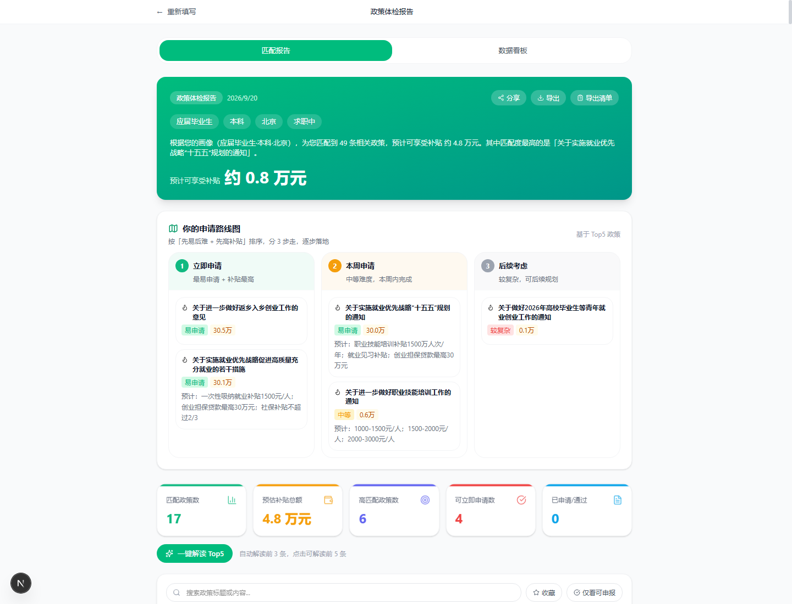
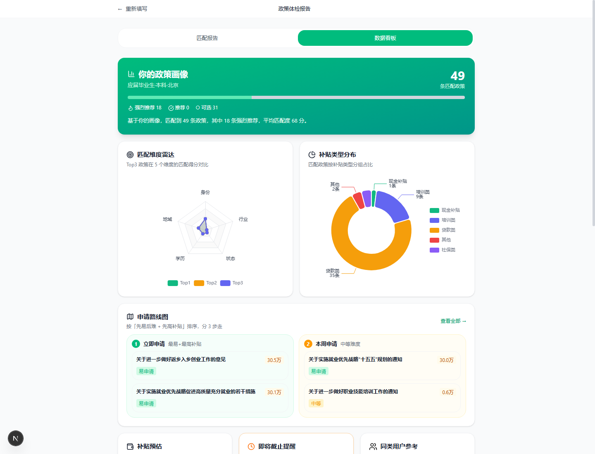
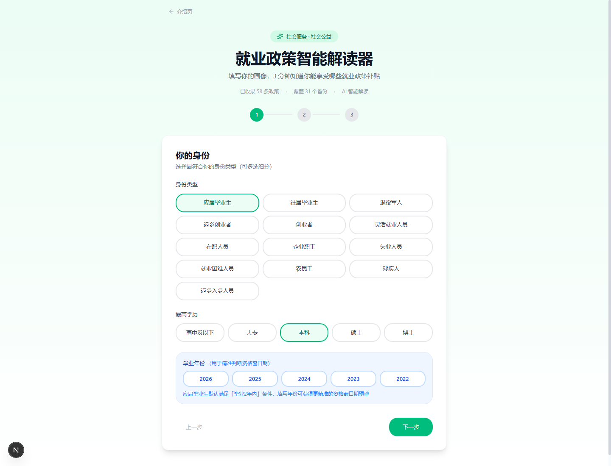
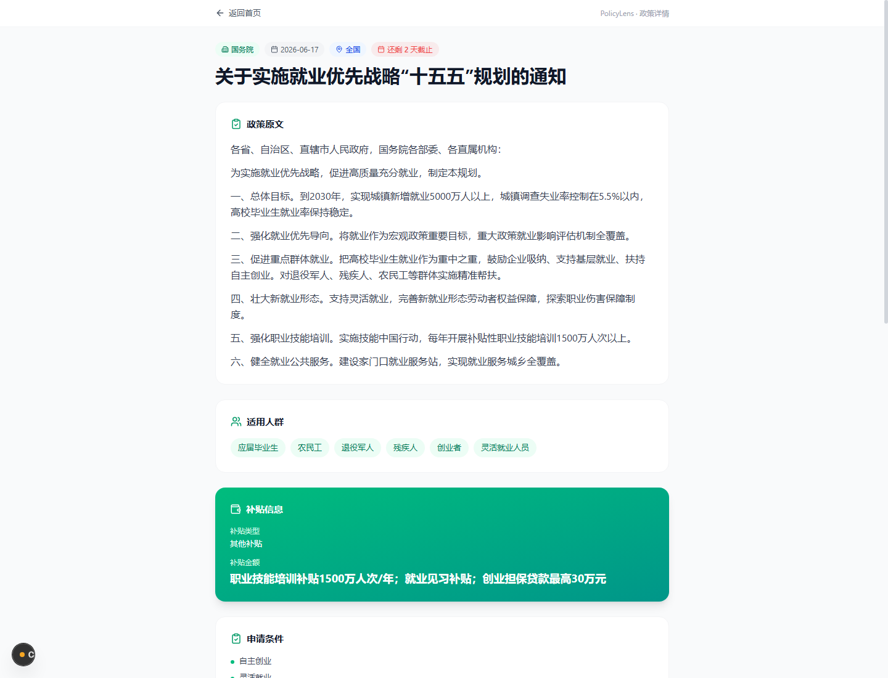
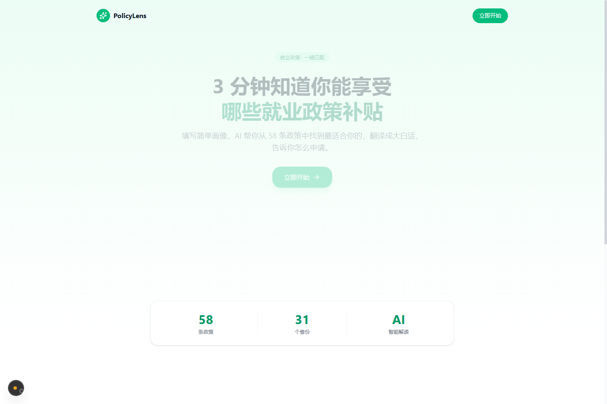

# 🔍 PolicyLens · 就业政策智能解读器
### 基于 Next.js 16 + 多维原子规则引擎 + 智谱大模型的青年就业补贴体检与申请路线系统

[](https://trae.ai)
[](#)
[](https://nextjs.org/)
[](https://react.dev/)
[](https://www.typescriptlang.org/)
[](https://tailwindcss.com/)
[](https://echarts.apache.org/)
[](https://vitest.dev/)

> **让国家政策红利触达每一位青年** —— 消除政务文本壁垒，3 步填写基础画像，3 分钟算清你能享受哪些就业补贴、申请难度与履约步骤。已收录全国 **31 省 58 条核心政策**。

---

## 💡 为什么需要这个项目？

### 传统就业政策申报痛点
- **“找不到”**：政策条文分散在人社部、发改委、退役军人事务部及各省市数百个政务网站，形成信息孤岛；
- **“读不懂”**：官方发文动辄上万字，条文充满政务专业术语，普通青年难以快速定位“我能不能报”、“报了能拿多少钱”；
- **“办不成”**：申报条件往往隐含“毕业2年内”、“特定行业”、“社保缴纳状态”等严苛时间窗口，极易错过截止日期；
- **纯 LLM 暴力方案缺陷**：若将全部政策全文直接喂给大模型，不仅消耗数十万 Token、响应长达数十秒，且极易因“模型幻觉”给出错误申报指引。

### PolicyLens 核心破局方案
1. **轻重结合分层架构 (Rule + LLM Hybrid)**：
   - **0 成本本地规则引擎前置过滤 90%**：将 58 条政策解构成 10 类原子准入条件（`AtomicCondition`），毫秒级完成资格初筛与补贴测算；
   - **智谱 GLM-4.7-Flash 深度解读“最后一公里”**：仅对匹配成功的重点政策调用大模型，将其翻译成“大白话”并结构化提取为 10 个关键字段；
2. **“先易后难 + 先高补贴”智能申请路线图**：
   - 不仅列出政策，更按申报门槛与预期补贴对政策进行分级编排（立即申请 / 本周申请 / 后续考虑），帮助用户逐步推进落地；
3. **ECharts 五维雷达图与资金分布看板**：
   - 5 维度对比（身份、学历、地域、状态、行业）与补贴类型分布，政策画像一目了然；
4. **94 个自动化测试用例保障 (Zero Hallucination)**：
   - 核心规则匹配与积分测算逻辑具备 100% 覆盖的 Vitest 单元测试，杜绝任何判定逻辑回归。

---

## 🖥️ 真实交互界面与视觉证明链 (UI Proof of Concept)

为方便评审专家直观查验，项目包含高保真 Web 交互界面与数据看板（本地运行真实捕获）：

### 1. 政策体检报告与智能申请路线图 (`/report`)
> 呈现综合补贴预估、4 组决策卡片，以及按“先易后难 + 先高补贴”排序的落地行动路线，支持一键解读与官方入口直达。


### 2. ECharts 匹配维度五维雷达图与资金分布 (`/report?tab=dashboard`)
> 动态展示用户与 Top3 政策在 5 个维度的匹配吻合度，结合甜甜圈图直观展现贷款、培训、现金、社保等补贴结构。


### 3. 3 步用户画像与原子条件表单 (`/`)
> 极简交互设计，覆盖身份类型、最高学历、毕业年份（精准推算 2 年窗口期）、行政区划与就业意向。


### 4. 结构化政策解读与申报窗口期详情 (`/policy/[id]`)
> 包含政务原文精炼、适用人群标签、资格窗口倒计时预警、材料清单与官方申报入口。


### 5. TRAE AI 大赛参赛落地页 (`/landing`)
> 产品品牌传达、58 条全国政策覆盖看板与核心价值引导。


---

## 📐 整体系统架构与数据流

```
┌─────────────────────────────────────────────────────────────────────────────┐
│                             用户端 (Next.js 16 + React 19)                  │
│       [/landing] 介绍页  -->  [/] 3 步画像表单  -->  [/report] 匹配报告与看板    │
└──────────────────────────────────────┬──────────────────────────────────────┘
                                       │ 毫秒级触发 (Zustand 状态驱动)
                                       ▼
┌─────────────────────────────────────────────────────────────────────────────┐
│                 轻量级本地多维原子规则引擎 (Local Rule Engine)                │
│   ├── 10 类原子条件解析器 : 身份 / 学历 / 毕业年份 / 地域 / 状态 / 行业 / 社保 ...  │
│   ├── 准入判定与容错映射 : 语义近似对齐 + 毕业 2 年窗口期动态推导             │
│   └── 积分测算与路线规划 : 先易后难分级 + 预估补贴总额加总算法               │
│   [验证保障] 94 个 Vitest 单元测试用例 100% 通过                             │
└──────────────────────────────────────┬──────────────────────────────────────┘
                                       │ 筛选出 Top 优质政策
                                       ▼
┌─────────────────────────────────────────────────────────────────────────────┐
│                     智谱大模型结构化解读服务 (GLM-4.7-Flash)                 │
│   ├── 限制性 Prompt 工程 : 提取 10 维结构化字段 (申报入口/材料清单/办理地点)    │
│   └── 工程化防护网       : IP 频次限流 + 输入字符校验 + 并发请求去重防重入    │
└──────────────────────────────────────┬──────────────────────────────────────┘
                                       │
                                       ▼
┌─────────────────────────────────────────────────────────────────────────────┐
│                        数据呈现与全渠道服务闭环                             │
│   ├── 可视化呈现   : ECharts 懒加载 (五维匹配雷达图 + 补贴类型分布玫瑰图)     │
│   ├── 搜索引擎优化 : SSG 静态预渲染 58 个政策详情页 + JSON-LD + OpenGraph   │
│   ├── 全渠道分享   : 画像紧凑 Base64 URL Query 编码，支持微信/社媒一键还原  │
│   └── 导出与离线   : html2canvas-pro + jsPDF 生成分享长图与 PDF；PWA 离线运行│
└─────────────────────────────────────────────────────────────────────────────┘
```

---

## 🔬 核心技术亮点与测试矩阵

### 1. 10 类原子条件匹配引擎 (`src/lib/matcher/`)
将模糊的政务文本准入条件彻底拆解为标准判别器：
- `IdentityMatcher`: 支持应届毕业生、返乡创业者、退役军人等 13 类交叉身份识别；
- `EducationMatcher`: 大专、本科、硕博阶梯兼容判断；
- `GraduationYearMatcher`: 基于系统当前年份与毕业年份动态判断“毕业2年内”法定窗口期；
- `RegionMatcher`: 省/市/全国三级穿透；
- `StatusMatcher`: 求职中、灵活就业、失业登记精准对齐。

### 2. 94 个自动化单元测试用例全通
```bash
npm test
```
```text
 ✓ src/lib/matcher/scoreCalculator.test.ts (33 tests)
 ✓ src/lib/matcher/atomicConditions.test.ts (38 tests)
 ✓ src/lib/matcher/ruleMatcher.test.ts (23 tests)

 Test Files  3 passed (3)
      Tests  94 passed (94)
```

---

## 🚀 快速开始 (Quick Start)

### 1. 环境准备
- **Node.js**: 20+ (推荐 Node.js v24)
- **包管理器**: npm 或 pnpm

### 2. 安装项目依赖
```bash
# 克隆仓库
git clone https://github.com/akkomylove/policylens.git
cd policylens

# 安装依赖
npm install
```

### 3. 配置 AI 接口密钥 (可选)
复制环境变量模板：
```bash
cp .env.example .env.local
```
在 `.env.local` 中填入智谱开放平台 API Key：
```env
GLM_API_KEY=your_zhipu_api_key_here
```
> 💡 **免 API Key 体验模式**：若未配置 API Key，系统的多维政策规则匹配、ECharts 数据看板、申请路线图、58 条政策详情浏览完全不受影响，仅 AI 实时在线问答与大白话实时翻译降级为离线预设模式。

### 4. 启动本地开发服务
```bash
npm run dev
```
浏览器直接访问：
- 🔍 **核心政策匹配**：`http://localhost:3000`
- 📊 **可视化体检报告**：`http://localhost:3000/report`
- 📈 **ECharts 数据看板**：`http://localhost:3000/report?tab=dashboard`
- 📖 **产品参赛主页**：`http://localhost:3000/landing`

> 📸 **自带自动化无头截图流水线**：项目内置了 `python capture_screenshots.py`，启动本地服务后可一键通过无头浏览器截取最新高清全图并同步更新至文档资产库。

---

## 📁 目录结构

```
policylens/
├── public/
│   ├── data/
│   │   ├── policies.json       # 58 条全国结构化政策知识库
│   │   └── stats.json          # 宏观就业统计数据
│   └── manifest.webmanifest    # PWA 清单
├── src/
│   ├── app/
│   │   ├── api/                # 后端端点 (AI 解读/追问/去重/限流)
│   │   ├── landing/            # 竞赛参赛产品介绍落地页
│   │   ├── policy/[id]/        # 58 条政策 SSG 静态详情页
│   │   ├── report/             # 政策匹配报告与 ECharts 数据看板
│   │   └── page.tsx            # 核心主页 (3 步画像表单)
│   ├── components/
│   │   ├── Dashboard/          # 数据看板 (next/dynamic 懒加载 ECharts)
│   │   ├── PolicyChat/         # AI 智能追问侧边栏
│   │   ├── ProfileForm/        # 用户画像表单组件
│   │   └── Report/             # 报告渲染与 4 步进度跟踪
│   ├── lib/
│   │   ├── matcher/            # 10 类原子条件规则匹配引擎与积分算法
│   │   ├── store.ts            # Zustand 全局状态管理
│   │   └── share.ts            # Base64 画像 URL 编码与分享工具
│   └── types/                  # TypeScript 类型定义全景
├── docs/
│   └── assets/                 # 真实运行界面高清证明截图
├── capture_screenshots.py      # 无头浏览器自动化截图脚本
├── DECISIONS.md                # 架构演进与技术决策记录 (遵循全局研发宪法)
├── package.json
└── README.md                   # 本说明文档
```

---

## 📜 决策记录与工程演进 (DECISIONS.md)

本项目严格坚持“商业/社会 ROI 意识”与“零盲猜”工程原则：
- 详细设计权衡（为何不全量调用大模型、如何通过原子条件拆解实现零幻觉、ECharts 懒加载优化策略等）均已沉淀在 [DECISIONS.md](file:///D:/Akko的项目文件/01_AI智能体与创新竞赛/policylens/DECISIONS.md)。

---

## 🏆 参赛信息与版权

- **赛事**：TRAE AI 创造力大赛 (TRAE AI Creativity Contest)
- **赛道**：社会服务赛道 + 社会公益附加赛道
- **作者**：Akko (`akkomylove`)
- **开源协议**：本项目基于 MIT License 开放交流学习。
